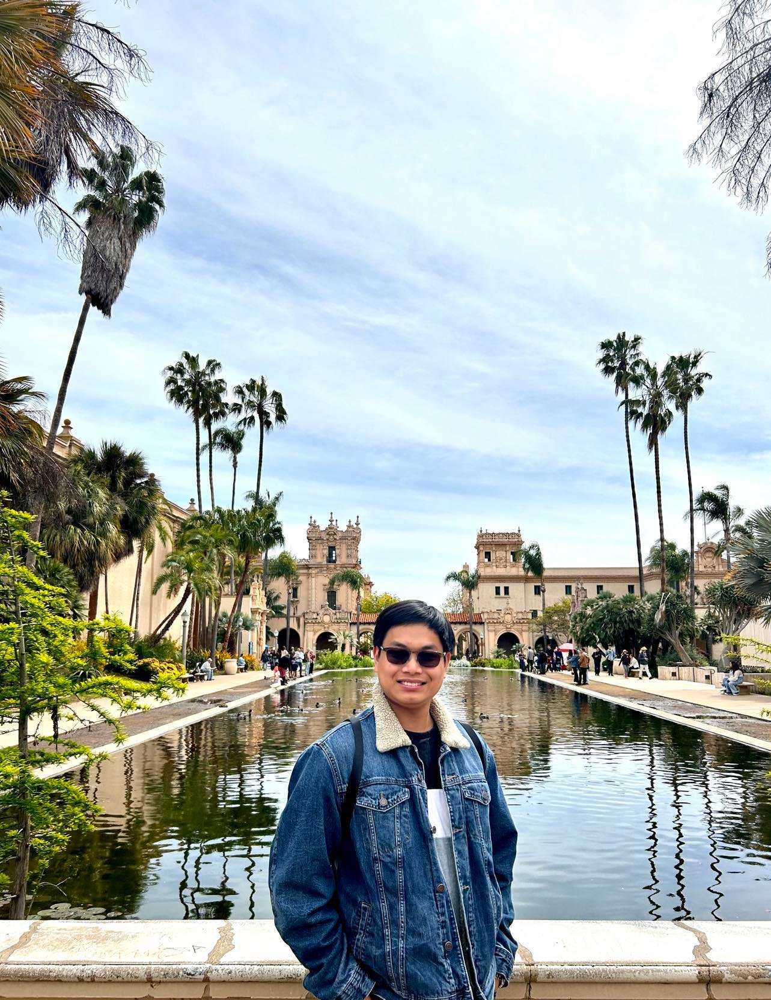

# Minh's User Page

## About

[Programmer](https://m7duong.github.io/CSE-110/#programmer)

[Personal](https://m7duong.github.io/CSE-110/#personal)

### Programmer

    Hi, my name is Minh Duong, and I am currently studying Computer Science at UC San Diego.

As a programmer, I have learned **3** programming languages so far:
  - C++ (intermediate)
  - Java (intermediate)
  - Python (beginning)

I know that there are many fields for Computer Science to work on, such as: 
1. Backend
2. Frontend
3. Fullstack
4. Web developer
5. Cyber Security
6. Software Developer
7. etc

I am currently interested in Game Developer because simply I love playing video games. 

***Goal***

> As a programmer, I need to know as much language as possible in order to be flexible in the work. Therefore, I want to set a goal to learn some more programming language until the end of the year:

        Python (most popular programming language)
        MATHLAB (need for Math course)
        C# (helpful for game developer)
        Javascript (if I want to switch to front-end or full-stack)

[Reaching goal](https://www.google.com/url?sa=i&url=https%3A%2F%2Fdribbble.com%2Fshots%2F9701661-Hard-Work-The-Only-Shortcut-to-Success%2Fattachments%2F1731041%3Fmode%3Dmedia&psig=AOvVaw2LxK3vVmCijI8cpVxzYU4_&ust=1680831119975000&source=images&cd=vfe&ved=0CA4QjRxqFwoTCMj134COlP4CFQAAAAAdAAAAABAE)

### Personal

[Personal introduction](https://m7duong.github.io/CSE-110/personal.html)
