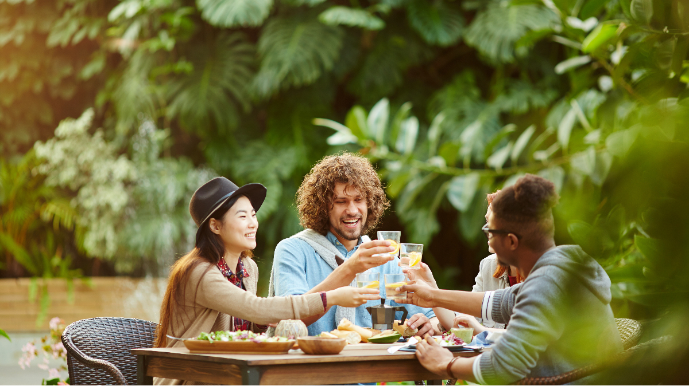
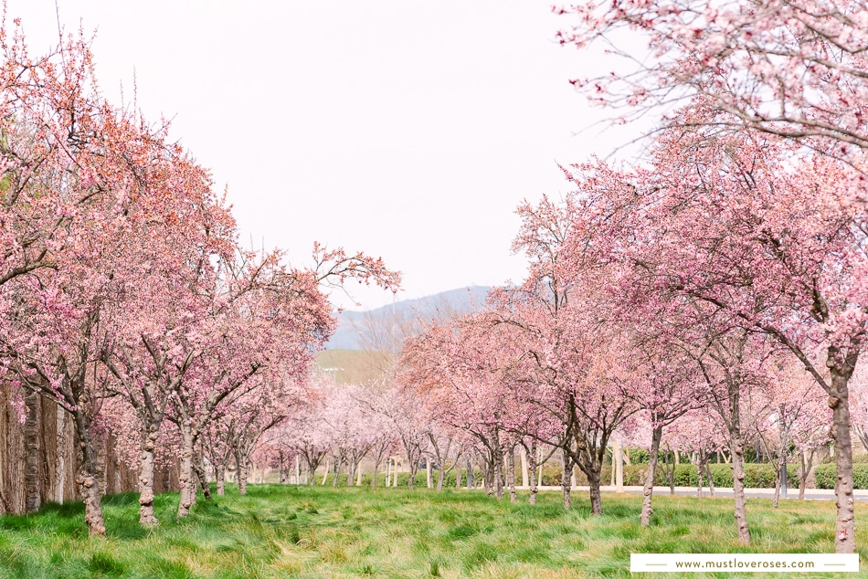

# Personal

As a human-being, we all have different hobbies during free time, and so do I. During my free time, I usually:

- Hang out with my friends

- Play video games

- Play badminton

My hometown was from Hayward, Northern California. During the spring break, I flied back to visit my parents. 
We spend a short time to go seeing Cherry Blossom in San Francisco, which is very fun. 

Overall, I believe that my combination of technical skills, communication abilities, and passion for learning make me an effective and valuable member of any programming team.
